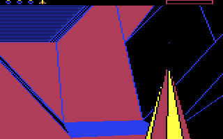

***Claude - including Fable - was unable to solve this simple game from 1986 without my help. Is what it is.***


# The Sentinel — ROM-faithful model + live driver

A ROM-faithful model of **The Sentinel** (Geoff Crammond, Firebird, 1986) on the
Commodore 64, plus a live driver that plays the real game in
[VICE](https://vice-emu.sourceforge.io/) (asid-vice) by keyboard and records an AVI.
Transition primitives are validated byte-for-byte against the real 6502 code (golden
fixtures, so CI proves them without the ROM); the enemy clock is gated frame-for-frame
against the running game by the divergence instrument.

The phase player wins **live, on the real game**, verified by the ROM's own
landscape-complete flag (`$0CDE` bit 6) — including landscape 1442, which carries the
game's full complement of **eight enemies** (the Sentinel and seven sentries), in 29
actions, final energy 5:



```bash
pip install -r requirements.txt
pytest -n auto

python -m sentinel.phase_player 335     # offline, prints the action trace
python -m driver.play_player 335        # live in VICE, records an AVI
python -m driver.instrument 42          # race the model against the ROM, frame for frame
python -m driver.avi2apng renders/player_ls335_win.avi   # the AVI as an embeddable APNG
```

| landscape | enemies | offline | live |
|---|---|---|---|
| 0 | 1 | 29 | — |
| 42 | 2 | 32 | **36 actions** (enemies frozen) |
| 60 | 7 | 44 | — |
| 110 | 3 | 35 | — |
| 298 | 7 | 36 | — |
| 321 | 7 | 28 | — |
| 335 | 7 | 60 | **66 actions** |
| 373 | 7 | 32 | — |
| 1442 | 8 | 47 | **29 actions** |

Offline counts are under the ROM-derived settle prices (`sentinel/settlecost.py`). The ls42
live entry is a `driver.frozen_run` win (`update_enemies $16B5` RTS-stubbed): it verifies
frame-cost fidelity, not survival under fire.

Enemy counts include the Sentinel, so eight is the game's maximum. The ls1442 live run is
recorded in full: [media.md](docs/media.md) covers turning that AVI into the APNG above.
A still from the ls335 win is [here](docs/media/ls335_phase_win.png).

A landscape is identified by one number: the one a player types on the keypad. Every tool
here — `driver.play_player`, `sentinel.phase_player`, `sentinel.player`, `sentinel.isoview`
— takes exactly that number, and `Game.typed(335)` builds the same board offline.

## Layout

| Area | Path | Role |
|------|------|------|
| Model | `sentinel/` | standalone forward model — terrain, LOS/aim, actions, energy, enemies, landscape generation (no emulator). Transition primitives are byte-for-byte against the 6502; see [architecture.md](docs/architecture.md) for what is exact and what is not |
| Phase player | `sentinel/phase_player.py` | the default player: freedom first, then convert. Wins all eight measured boards |
| Reactive player | `sentinel/player.py` | tick-by-tick greedy player over the same `BasePlayer` |
| Landscape atlas | `sentinel/atlas.py`, `sentinel/statecache.py` | per-landscape metrics (enemies, energy, terrain shape) over a cache of generated boards; `--like` matches one board to another |
| Driver | `driver/` | boot, enter a landscape, run memory-verified live keyboard operations (aim → fire → verify), record. Imports only `sentinel/` |
| Instrument | `driver/instrument.py`, `sentinel/statecmp.py` | frame-locked sim-vs-emulator divergence: seed the sim from the live image, step both one frame at a time, report the first disagreement |

## Fixtures (not distributed)

The game is copyrighted and is **not** included. There is **one** supplied fixture: place
your own copy of the C64 tape image at `sentinel-gold.tap`.

`out/sentinel_stage2.bin` — the 64 KB memory image of the loaded game, used by the
`oracle`-marked tests that regenerate the goldens — is **not** a second supplied file: it is
**generated** from the tape. `driver/dump_stage2.py` boots the tape in asid-vice, dumps RAM,
and verifies the image by running the ROM's own generator against the model:

```bash
python -m driver.dump_stage2                    # --out PATH, --force to re-dump
```

Both files are gitignored; tests that need them auto-skip when absent. Generating the image
and running the live driver need Docker and the `anarkiwi/asid-vice:latest` image (build
from https://github.com/anarkiwi/asid-vice).

## Docs

- [gameplay.md](docs/gameplay.md) — the game's rules and mechanics, ROM-derived spec.
- [architecture.md](docs/architecture.md) — the landscape's geometry and the constraints it
  imposes, the game's state machines, one table mapping every ROM routine to its model
  function and validation, then the subsystems: landability filter, render-cost model,
  driver, instrument, measurement tooling.
- [players.md](docs/players.md) — the phase player and the reactive greedy player: the rules
  that decide a move, the phases, current results.
- [media.md](docs/media.md) — turning a recorded run into an embeddable APNG, and the
  blank test that drops the hyperspace and transfer frames.
- [open_items.md](docs/open_items.md) — everything unsolved, and what was disproved.
